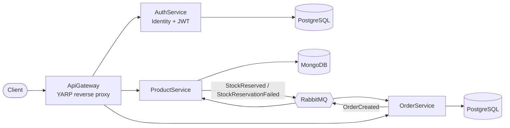

# E-Commerce Microservices

A .NET 10 e-commerce backend built with a microservices architecture: JWT authentication with role-based access control, event-driven stock management via RabbitMQ/MassTransit, a YARP API gateway, and full Docker Compose orchestration.

[](https://github.com/kemgangchristian/ecommerce-microservices/actions/workflows/ci.yml)

## Architecture



| Service | Responsibility | Storage | Auth |
|---|---|---|---|
| **AuthService** | Register/login, JWT issuance, role management | PostgreSQL | Identity (`ApplicationUser`, `IdentityRole`) |
| **ProductService** | Product catalog (CRUD), stock reservation on order creation | MongoDB | JWT bearer, `Admin`-only writes |
| **OrderService** | Order creation, publishes `OrderCreated` events | PostgreSQL | JWT bearer, any authenticated user |
| **ApiGateway** | Single entry point, routes `/api/auth`, `/api/products`, `/api/orders` | — | Passes JWT through |

Order/stock flow: `OrderService` publishes `OrderCreated` → `ProductService` consumes it, decrements stock per item, and either publishes `StockReserved` (success) or rolls back the items already reserved and publishes `StockReservationFailed` (insufficient stock on any item).

## Tech Stack

- **.NET 10** — minimal APIs, top-level statements
- **ASP.NET Core Identity** + **JWT Bearer** authentication, role-based authorization policies
- **Entity Framework Core** + **Npgsql** (PostgreSQL) — AuthService, OrderService
- **MongoDB.Driver** — ProductService (repository pattern, no EF)
- **MassTransit** + **RabbitMQ** — async pub/sub between OrderService and ProductService
- **YARP** (`Yarp.ReverseProxy`) — API gateway
- **Docker** / **Docker Compose** — multi-stage builds, full-stack orchestration
- **xUnit**, **Testcontainers**, `WebApplicationFactory`, MassTransit `ITestHarness` — testing
- **GitHub Actions** — CI (build, test, Docker image validation)

## Roles & Authorization

Two roles: `Admin` and `Customer`.

- `POST /api/auth/register` — creates a user with the `Customer` role. **Does not return an access token** (register is not a login).
- `POST /api/auth/login` — returns a JWT access token.
- `GET /api/auth/me` — returns the authenticated user's claims (any authenticated user).
- `POST /api/auth/users/{id}/roles` — **Admin-only**. Replaces the user's role set (exclusive assignment — a user is either `Admin` or `Customer`, never both).
- Product writes (`POST`/`PUT`/`PATCH`/`DELETE /api/products`) — **Admin-only**. `GET` is public.
- Order creation (`POST /api/orders`) — any authenticated user.

## Getting Started

### Prerequisites

- [.NET 10 SDK](https://dotnet.microsoft.com/download)
- [Docker](https://www.docker.com/) + Docker Compose

### Run with Docker Compose (recommended)

1. Copy the environment template and fill in your own values:

   ```bash
   cp .env.example .env
   ```

   Required variables: `POSTGRES_USER`, `POSTGRES_PASSWORD`, `RABBITMQ_USER`, `RABBITMQ_PASSWORD`, `RABBITMQ_ERLANG_COOKIE`, `JWT_ISSUER`, `JWT_AUDIENCE`, `JWT_KEY` (generate with `openssl rand -base64 48`), `JWT_EXPIRES_MINUTES`, `SEED_ADMIN_EMAIL`, `SEED_ADMIN_PASSWORD`, `GATEWAY_PORT`.

2. Build then start (build and start are kept separate to avoid resource contention during RabbitMQ startup):

   ```bash
   docker compose build
   docker compose up -d
   ```

3. The API is available through the gateway at `http://localhost:${GATEWAY_PORT}` (e.g. `http://localhost:8000/api/auth/register`).

### Run locally without Docker

Each service needs its connection strings/secrets configured via `dotnet user-secrets` (not committed to source control):

```bash
cd src/AuthService
dotnet user-secrets set "ConnectionStrings:DefaultConnection" "..."
dotnet user-secrets set "Jwt:Key" "..."
dotnet ef database update
dotnet run
```

Repeat per service (`ProductService`, `OrderService`, `ApiGateway`), each with its own connection string / config as needed. PostgreSQL, MongoDB and RabbitMQ must be running locally or via `docker compose up -d postgres mongodb rabbitmq`.

## Testing

```bash
dotnet test
```

Includes unit tests (in-memory config/EF InMemory), integration tests via `Testcontainers` (ephemeral PostgreSQL/MongoDB/RabbitMQ containers) and `WebApplicationFactory<Program>` (real HTTP pipeline, including JWT/RBAC middleware), and MassTransit `ITestHarness` tests for the stock-reservation consumer, including the compensation/rollback path.

## CI/CD

GitHub Actions (`.github/workflows/ci.yml`) runs on every push/PR to `main`:

- **Build & Test** — restores, builds, and runs the full test suite. Required to pass before a PR can be merged.
- **Docker Build (validation)** — builds all 4 service images (matrix), push-to-`main` only. Validates the Dockerfiles without publishing images anywhere.

## Git Workflow

Direct commits to `main` are not used. Every change goes through a feature branch and a pull request:

```bash
git checkout main && git pull origin main
git checkout -b feature/my-change
# ... commit ...
git push -u origin feature/my-change
# open PR on GitHub, merge once checks pass
```

## Project Structure

```
src/
  AuthService/       # Identity, JWT issuance, role management
  ProductService/     # Product catalog, stock reservation consumer
  OrderService/       # Order creation, OrderCreated publisher
  ApiGateway/          # YARP reverse proxy
  Shared/
    ECommerce.Contracts/ # Shared event contracts (OrderCreated, StockReserved, ...)
tests/
  AuthService.Tests/
  ProductService.Tests/
  OrderService.Tests/
  Integration.Tests/
.github/workflows/ci.yml
docker-compose.yml
```
